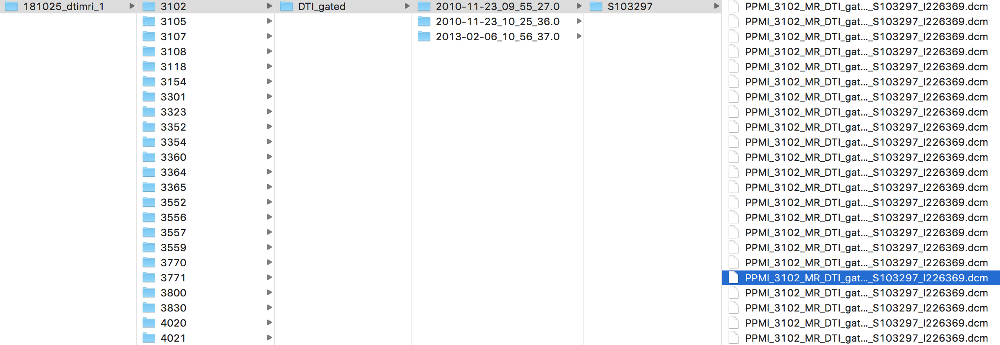

# GCNeuro
### Developing a Graph Convolution-Based Analysis Pipeline for Multi-Modal Neuroimage Data: An Application to Parkinson’s Disease
#### Christian McDaniel and Shannon Quinn

This work contains the code involved in an end-to-end neuroimage analysis pipeline. The pipeline preprocesses anatomical (T1w) MRI and diffusion MRI and combines them in a single graph-based format. In this format, the nodes of the graph are defined by anatomical regions of interest (ROIs) and the diffusion data is depicted as signals, or vectors, defined on these nodes. 

The graphs are processed using a novel graph convolutional network (GCN) architecture.

The paper, titled *Developing a Graph Convolution-Based Analysis Pipeline for Multi-Modal Neuroimage Data: An Application to Parkinson’s Disease* and which explains the pipeline in detail, has been published in the 2019 SciPy Proceedings.

## Dependencies

Below is a list of the dependencies needed. See the file `setup` for installing all dependencies. This file assumes installation is on a Google Cloud virtual machine and needs to be modified with specific file paths. 

Non-python libraries: `bzip2` |  `git` | `libxml2-dev` | `unzip` | `tcsh` | `bc` | `docker.io`

Python libraries: 
  `time` | `math` | `argparse` | `os` | `sys` | `shutil` | `subprocess` | `json` | `builtins` | `pickle` | `datetime` | `numpy` | `scipy` | `pandas` | `sklearn` | `matplotlib` | `seaborn` | `joblib` | `nibabel` | `dipy` | `torch`

Softwares:
  python 3.5 or greater | [Freesurfer](http://www.freesurfer.net) | [FSL](https://fsl.fmrib.ox.ac.uk/fsl/fslwiki) | [MATLAB Compiler Runtime](https://www.mathworks.com/products/compiler/matlab-runtime.html) | [BrainSuite](http://brainsuite.org) | [Diffusion Toolkit](http://trackvis.org/dtk/) 

## How to Run the Pipeline

The pipeline assumes data has been downloaded from the [PPMI](https://www.ppmi-info.org) database using the "Multi-Zip Download" feature, and that the zip files are all stored in a single directory. Below is a depiction of the PPMI file structure: 

If your file structure differs from this, you may need to make some changes in the `neuro_format.py` and `make_bids.py` files. 

Next, we have listed the order of the main scripts to be run. Many of these scripts take a long time to run and represent disctinct stages of the pipeline; each is a potential source for modification throughout the pipeline. As such, we have kept them separate as opposed to uniting them in a single executible file. Each file can by run from the terminal with the command 

`python <name_of_file.py> <arg_1> ... <arg_n>`. 

Depending on your setup, `python3` may need to be used instead of `python`.

The order of files to run is as follows: 

1. `neuro_format.py <download_dir> <destination_dir>`
2. `make_bids.py <main_dir>`
3. `automate_preproc.py <main_dir>`
4. `gen_nodes.py <main_dir>`
5. `adj_mtx.py <main_dir>`
6. `gen_features.py <main_dir> <dtk_dir>`
7. `dtk.py <main_dir> <dtk_dir>`
8. `retrieve_outputs.py <main_dir>`
9. `train.py <main_dir>`
